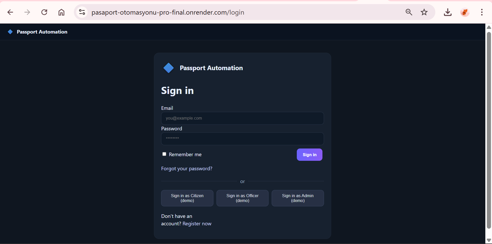

# Passport Automation System (Flask)

A Flask-based web application that digitizes internal passport application handling and manages the full workflow securely — from submission to final decision — using role-based access control.

**Live Demo:** https://pasaport-otomasyonu-pro-final.onrender.com

## Demo Preview

> Demo accounts are provided for demonstration purposes only. Please do not submit real personal data.


## Project Overview
This project simulates a real-world internal application management system with **User** and **Admin** roles.  
The goal was to gain hands-on experience in **web development**, **workflow automation**, **authentication**, and **responsible data handling**.

---

## Features
- Role-based authentication (**User / Admin**)
- Secure user login and session management
- Create, submit, and track passport applications
- Admin panel for reviewing applications
- Approve / reject actions with review notes
- Email notifications via **SMTP**
- Basic filtering and reporting for applications

---

## Security & Data Handling Considerations
- Separation of user and admin privileges (least-privilege approach)
- Input validation to reduce invalid or malformed data
- Controlled access to review actions (admin-only endpoints)
- Structured handling of sensitive user-submitted information
- Awareness of common web security practices for Flask-based systems

> Note: This project is for learning purposes and does not claim production-level security.

---

## Tech Stack
- Python
- Flask
- HTML / CSS
- SQLite
- SMTP (email notifications)
- Git & GitHub
## Quick Start

### 1) Create and activate a virtual environment

**Windows**
```bash
python -m venv .venv
.\.venv\Scripts\activate

macOS / Linux
python -m venv .venv
source .venv/bin/activate

2) Install dependencies
   pip install -r requirements.txt
3) Run the application
   python app.py
Alternatively (Flask CLI)
set FLASK_APP=app.py
flask run
```md
## What I Learned
- Designing end-to-end workflows for real-world applications
- Implementing role-based access control
- Building backend logic with Flask
- Handling user data responsibly and securely
- Applying security concepts in web applications
